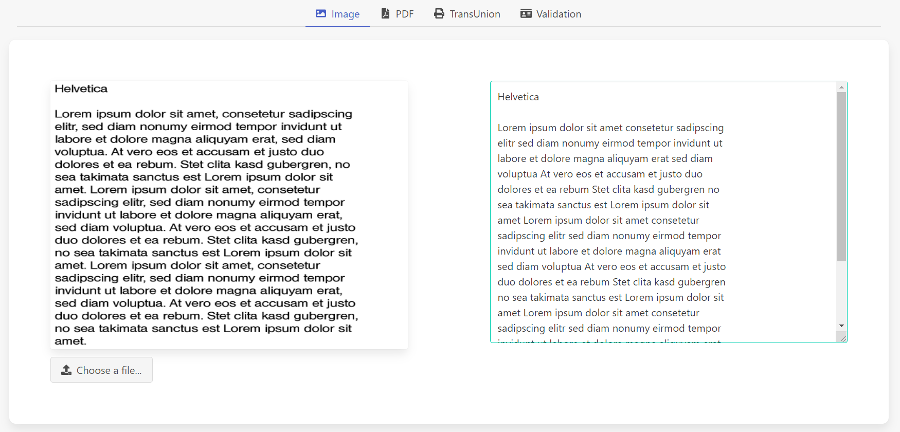
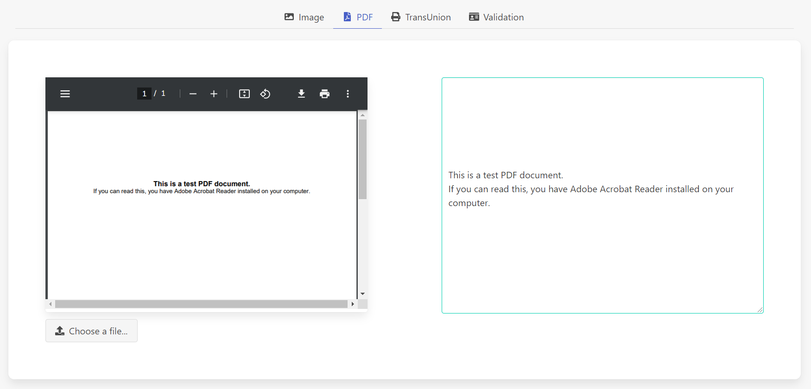
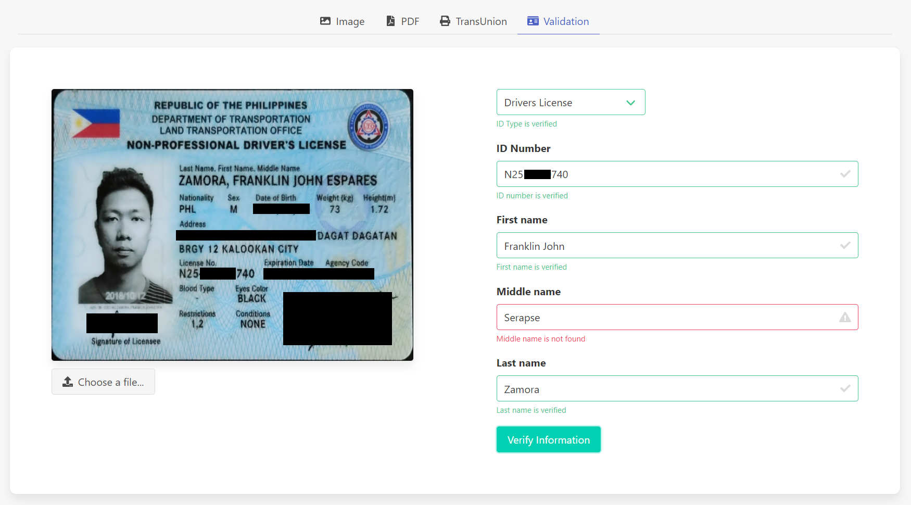
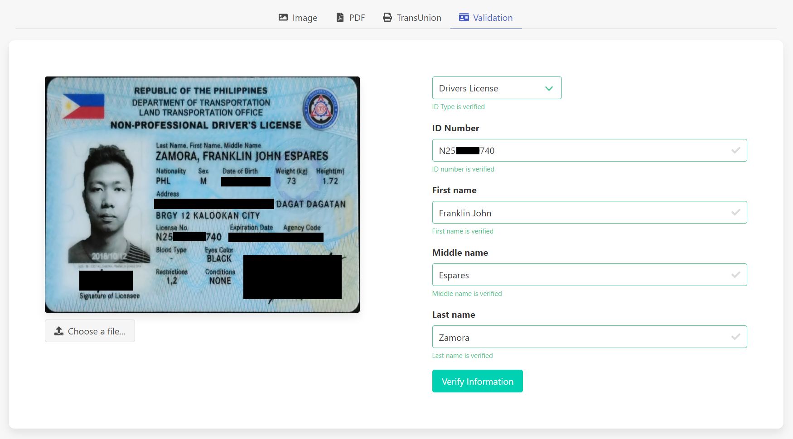

# OCR

Implementation of Optical Character Recognition using Tesseract and PDFBox.

## Technology Used

### Tesseract OCR

Tesseract was originally developed at Hewlett-Packard Laboratories Bristol and at Hewlett-Packard Co, Greeley Colorado between 1985 and 1994, with some more changes made in 1996 to port to Windows, and some C++izing in 1998. In 2005 Tesseract was open sourced by HP. From 2006 until November 2018 it was developed by Google.

github link: https://github.com/tesseract-ocr/tesseract

### OpenCV

OpenCV is a library of programming functions mainly aimed at real-time computer vision. Originally developed by Intel, it was later supported by Willow Garage then Itseez. The library is cross-platform and free for use under the open-source Apache 2 License

github link: https://github.com/opencv/opencv

### Apache PDFBox

The Apache PDFBox library is an open source Java tool for working with PDF documents. This project allows creation of new PDF documents, manipulation of existing documents and the ability to extract content from documents. Apache PDFBox also includes several command-line utilities. Apache PDFBox is published under the Apache License v2.0.

github link: https://github.com/apache/pdfbox

## Setup

- download https://github.com/tesseract-ocr/tessdata_best.git then move to `.\src\main\resources` folder
- download `pdfextract-custom-rbank-0.0.1-SNAPSHOT.jar` then move to `.\src\main\resources` folder
- Add the following maven dependencies
```xml
<!-- Tess4J -->
<dependency>
	<groupId>net.sourceforge.tess4j</groupId>
	<artifactId>tess4j</artifactId>
	<version>4.4.1</version>
</dependency>

<!-- OpenCV -->
<dependency>
	<groupId>org.openpnp</groupId>
	<artifactId>opencv</artifactId>
	<version>3.4.2-0</version>
</dependency>

<!-- PDFBox -->
<dependency>
	<groupId>org.apache.pdfbox</groupId>
	<artifactId>pdfbox</artifactId>
	<version>[2.0.15,)</version>
<dependency>

<dependency>
    <groupId>org.apache.commons</groupId>
    <artifactId>commons-lang3</artifactId>
</dependency>
```
- Set up Tesseract
```java
@Bean
Tesseract getTesseract() {
	Tesseract tesseract = new Tesseract();
	tesseract.setDatapath("./tessdata_best"); // tessdata_best path
	tesseract.setTessVariable("user_defined_dpi", "300"); // set dpi
	tesseract.setTessVariable("tessedit_char_whitelist","abcdefghijklmnopqrstuvwxyzABCDEFGHIJKLMNOPQRSTUVWXYZ1234567890 "); // set char whitelist
	return tesseract;
}
```

&nbsp;

# OCR Demo

## Features
- [Extract Text from Image](#extract-image-from-image)
- [Extract Text from PDF](#extract-image-from-pdf)
- [ID Card Validation](#id-card-validation)


## Extract Text from Image

- link: http://localhost:8080/ocr/image
- upload image file containing text characters
- returns extracted text characters


[(Back to top)](#features)

## Extract Text from PDF

- link: http://localhost:8080/ocr/pdf
- upload pdf file containing text characters
- returns extracted text characters


[(Back to top)](#features)

## ID Card Validation

- link: http://localhost:8080/ocr/validation
- upload a valid id
- sample result if a field has wrong input (**middle name** is *Serapse* instead of *Espares*)

- sample result if all fields are valid


[(Back to top)](#features)
